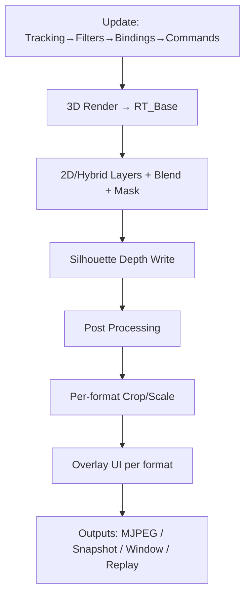
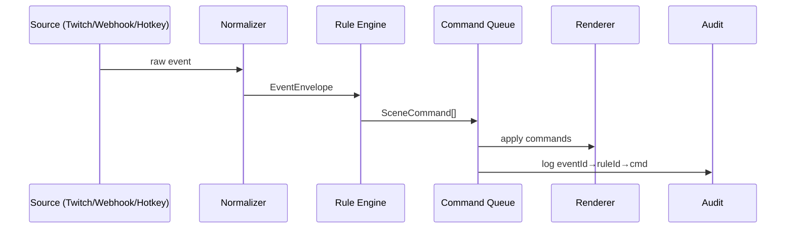
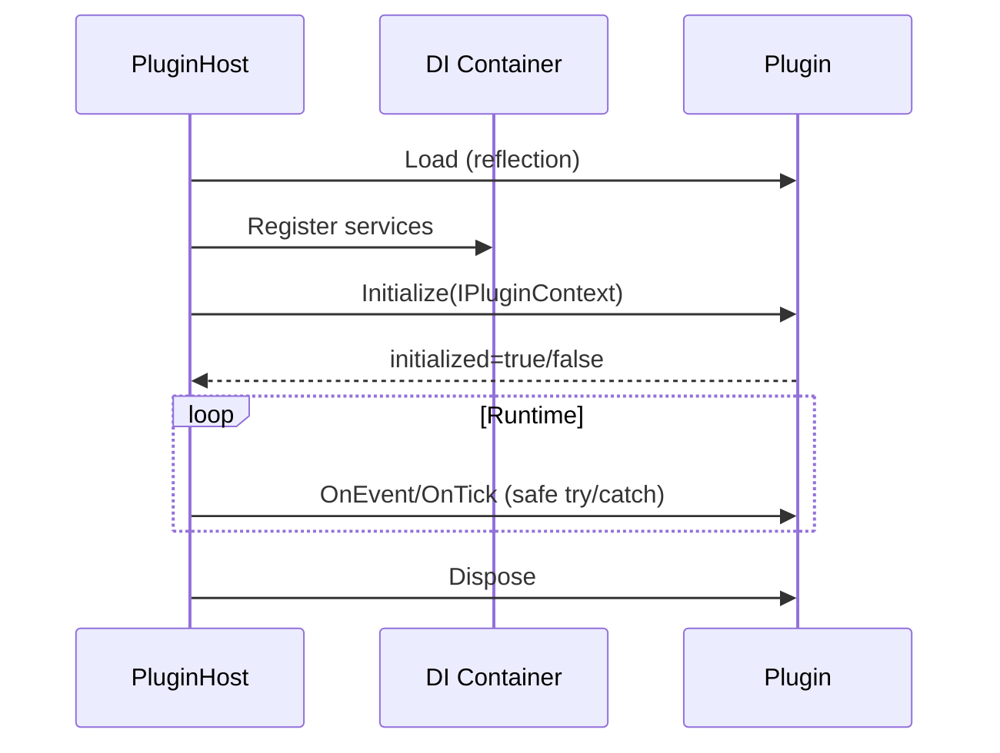

# VTube — архитектурный холст (MVP) — «всё в одном месте»

> Это **десктопное Windows‑приложение**, которое собирает **гибридную VTuber‑сцену (2D+3D)**, управляется локальным **web‑оркестратором**, расширяется **DLL‑плагинами** и отдаёт результат как **web‑трансляции по formatId** (для OBS через Browser Source) + фоллбек окна под Window Capture.
>
> Ключевая фишка: **всё управляется единым языком `SceneCommand`**, а Codex может гонять **рендер‑регрессии** на ПК владельца (snapshots → golden diff). Короче: меньше ручного «тык‑тык», больше «агент, делай красиво» 😈

---

## 0) TL;DR: что это за проект
### Пользовательский опыт
- Пользователь создаёт проект (`vtproj` как папка), добавляет сцену, персонажа, оверлеи и интеграции.
- Запускает приложение → поднимается локальный web‑сервис.
- Пользователь добавляет в OBS Browser Source ссылку `/view/<formatId>/release?...`.
- Во время стрима управляет сценой через web‑оркестратор/хоткеи/интеграции/плагины.

### MVP‑цели
- Гибридный рендер 3D+2D (URP), multi‑cam + derived форматы.
- Per‑format UI overlay (Unity UI) + debug/release.
- Integrations: Twitch chat + webhook + hotkeys.
- Плагины DLL + DI.
- Replay буфер 120с + NVENC H.264 + MKV.
- Тестируемость (Codex): snapshot/golden.

### MVP‑не‑цели (можно позже)
- Полный HTML/CSS overlay рендер.
- WebRTC playback как основной output.
- Полный визуальный редактор нод/оверлеев (в MVP — read‑only визуализация).

---

## 1) Термины (чтобы не путаться)
- **cameraId** — источник рендера (внутренняя камера сцены).
- **formatId** — финальный кадр: crop/scale + overlay + output‑профили.
- **profile** — вариант вывода формата: `debug` / `release`.
- **overlayProfileId** — набор UI‑виджетов (layout + assets) для формата.
- **layerId** — слой сцены (фон/персонаж/интеграции/FX и т.д.).
- **RenderItem** — атом отрисовки (2D/3D элемент, материал, маска, параметры).
- **Template (templateId)** — prefab‑подобная сущность (визуал+поведение) для runtime‑спавна.
- **Runtime state** — текущая сессия (оперативка).
- **Project state** — содержимое `vtproj` (истина, которую шарим/версионим).

---

## 2) Платформы
- MVP: **Windows**.
- Архитектура допускает macOS/Linux позже (не завязываемся на Win‑специфику в форматах проектов).

---

## 3) Структура проекта (`vtproj`)
### Проект как папка
- `vtproj/` — папка (git‑friendly).
- Экспорт: **Export as `.vtproj`** (архив для шаринга).

### Рекомендуемое дерево
```text
<project>/
  scene/
    scene.json
    cameras.json
    formats.json
    layers.json
    templates/            (опц., если захотим локальные для сцены — не MVP)
  characters/
    <charId>/character.json
  ui/
    overlays/<overlayProfileId>/overlay.json
    overlays/<overlayProfileId>/assets/
  assets/
    templates/<templateId>/template.json
    templates/<templateId>/assets/
    materials/
    textures/
    fonts/
  integrations/
    sources/
    rules/
    mappings/             (опц.)
  pipelines/
    dataGraph.json
    controlGraph.json     (опц.)
  outputs/
    profiles.json
  plugins/
    (опц.) project‑local DLL plugins
  docs/
    (опц.) внутренние заметки
```

### Secrets и workspace
- `.env` — секреты (НЕ коммитим).
- `workspace.json` — локально в профиле пользователя (НЕ в проекте).

---

## 4) Высокоуровневая архитектура
```mermaid
flowchart LR
  subgraph App[Desktop App (Windows)]
    R[Renderer (Unity URP)]
    DS[DataStore]
    CQ[Command Queue]
    PL[Plugin Host (DLL + DI)]
    TR[Tracking (MediaPipe)]
    RP[Replay Buffer]
  end

  subgraph Web[Local Web Service]
    ORCH[Web Orchestrator UI]
    API[HTTP API]
    VIEW[/view formatId/]
    MJPG[/stream MJPEG/]
    SNAP[/snapshot PNG/]
  end

  subgraph Ext[External]
    OBS[OBS Browser Source]
    TW[Twitch Chat]
    WH[Webhooks]
    HK[Hotkeys]
  end

  TW --> API
  WH --> API
  HK --> API

  ORCH --> API
  API --> CQ
  PL --> CQ
  TR --> DS
  CQ --> R
  R --> DS
  R --> MJPG
  R --> SNAP
  VIEW --> MJPG
  OBS --> VIEW
  RP --> R
```

---

## 5) Рендер и композитинг (Unity URP)
### Движок
- **Unity + URP** — единственный рендер‑пайплайн в MVP.

### Рендер‑цепочка по камере
1) **Update (1 раз за кадр)**
- Data Graph: webcam → tracker → filters → `ParameterSet`.
- `bindings.json`: параметры → деформации/трансформы/материалы.
- Применяем очередь `SceneCommand`.

2) **Base 3D Render (URP)**
- Рендер 3D мира в `RT_Base(cameraId)`.

3) **2D/Hybrid Layer Pass**
- Рисуем слои персонажа/2D RenderItems (multi‑plane) в `RT_Base`.
- Blend modes: `Normal/Add/Multiply/Screen`.
- Clipping: **1 маска** на RenderItem.
- Outline: включён в MVP.

4) **Silhouette Depth Write (по слоям)**
- Для слоёв с `silhouetteWrite=true` пишем depth по маске (alpha‑clip) для перекрытия 2D↔3D.
- Режим по умолчанию: **Silhouette** (Strict/Off — позже).

5) **Post + UI Overlay (per format)**
- Постпроцесс применяется к **скомпоженному** кадру.
- Для каждого `formatId`:
  - если `derived=true`: crop/scale от `RT_Base`;
  - затем overlay UI по `overlayProfileId`.

6) **Outputs**
- web streaming endpoints (debug/release)
- окна вывода (для OBS Window Capture)
- replay encoder (если `bufferize=true`)

### Реализация порядка в URP
- Порядок обеспечиваем через **ScriptableRendererFeature/Pass** (или RenderGraph на новых версиях), чтобы было детерминировано и тестируемо.



---

## 6) Камеры, форматы, профили
### Камеры
- `cameraId` — описывает позицию/параметры рендера и набор доступных форматов.
- У камеры есть `bufferize: bool` (для replay).

### Форматы
- `formatId` привязан к `cameraId`.
- `derived=true` означает crop/scale от базового RT, без отдельного 3D‑рендера.
- У формата есть `overlayProfileId`.

### Профили вывода (debug/release)
- debug/release — разные настройки вывода и набор overlay‑тегов.

---

## 7) UI/Overlays (per-format)
### Модель
- Камера рендерит сцену **без UI** → кадрирование под `formatId` → overlay per `formatId`.
- Профили: **debug** и **release**.

### Технология
- MVP: **Unity UI overlay** (Canvas/UIToolkit) → `RT_Overlay(formatId)` → композит в output.
- Интерфейс `IOverlayRenderer` + переключатель реализации (HTML overlay возможно позже).

### Управление
- `formats.json` хранит `overlayProfileId`.
- `SceneCommand`: `Format.SetOverlayProfile(formatId, overlayProfileId)`.

### Node editor (MVP)
- Node editor **read‑only визуализация** конфигов/графов.

---

## 8) Формат `overlay.json` (подробно)
Файл: `ui/overlays/<overlayProfileId>/overlay.json` + `assets/`.

### База
- `overlayFormatVersion: "1.0"`
- `design: { width, height }` — дизайн‑разрешение.
- `scaling.mode: fit|fill|stretch` (рек. `fit`).
- `scaling.snapToPixels: bool`.
- `safeArea.default: { left, top, right, bottom }` в px дизайн‑сетки.
- `widgets[]` с `RectTransform`‑подобным `transform`:
  - `anchorMin/anchorMax`, `pivot` (0..1)
  - `posPx/sizePx` в дизайн‑пикселях
- `tags[]` для debug/release.

### Debug vs Release
- Debug‑виджеты помечаются `tags:["debug"]`.
- Debug‑профиль включает debug‑теги, release — нет.

### Binding
- `bindings.textTemplate`, `bindings.valuePath`, `bindings.itemsPath`.
- DataStore пути: `scene.*`, `integrations.*`, `replay.*`, `vars.*`, `performance.*`, `system.*`.

### Шрифты
- У `Text` виджета можно указать `font` по имени (string).
- Резолвим через `assets/fonts/*` текущего overlayProfile.
- Если `font` не указан/не найден — используем дефолтный.

### Виджеты MVP
- `Text` (с `font`)
- `Image`
- `ProgressBar`
- `FeedList`
- `DebugHUD`

---

## 9) Вывод «просто трансляция» (MVP) — Streaming Endpoints
### Основная идея
- Отдаём финальную картинку **по `formatId`**, профили **debug/release**.
- По умолчанию доступ только localhost; remote включается явно.

### Endpoint’ы (MVP)
- `GET /view/<formatId>/<profile>` → HTML viewer (для OBS Browser Source и шаринга).
- `GET /stream/<formatId>/<profile>.mjpg` → MJPEG поток.
- `GET /snapshot/<formatId>/<profile>.png` → snapshot (превью/тесты).
- `GET /api/streams` → список стримов + URL.
- `GET /api/health`, `GET /api/metrics` → диагностика.

### Производительность
- `release`: 30 fps, `jpegQuality≈80`.
- `debug`: 15 fps, `jpegQuality≈60`.
- Slow‑client policy: **дропаем старые кадры**, клиент получает самый свежий.

### On‑demand
Формат/камера активны, если есть потребитель:
- соединение на `/stream/*` или `/view/*`
- окно вывода (Window Capture)
- `camera.bufferize=true` (replay)
Если потребителей нет → для этого формата **не рендерим и не кодируем**.

### Авторизация remote
- Токен в URL.
- Всё логируется аудитом.

---

## 10) Output Profiles
### Хранение
- `outputs/outputs.json`.
- `formatId` ссылается на профиль (реюз между форматами/камерами).

### Параметры (MVP)
- `fps`, `jpegQuality`, `maxViewers?`, `idleTimeoutSec`, `includeTags`.

### Snapshot
- Snapshot по умолчанию = **последний отрендеренный кадр**.

---

## 11) Web‑orchestrator (UI + API)
- Приложение поднимает локальный web‑сервис.
- Роли: Owner / Moderator / Viewer.
- Инвайт‑токены; для Browser Source — токен в URL.
- Аудит‑лог: кто/что/когда/результат.

---

## 12) `SceneCommand` v0.1
Единый язык управления сценой для UI/интеграций/плагинов.

MVP группы:
- `Layer.*` (enable/order/visibility)
- `Camera.*`, `Format.*` (вкл/профили/overlay)
- `Character.*` (params/expressions)
- `Fx.*` (trigger/enable)
- `Object.*` (spawn/despawn/set/attach)
- `Replay.*`

Очередь команд:
- `source`, `actorId`, `priority`, `timestamp`
- конфликты видны в логах

---

## 13) Плагины (DLL)
- Плагины = DLL, общий набор интерфейсов.
- На старте грузим через reflection, регистрируем в DI.
- `IPluginContext` даёт доступ к сервисам.
- Плагины могут менять логику через делегаты (если заложено в сервисах).
- Порядок плагинов настраиваем; конфликты фиксируются логами.
- Все вызовы через try/catch: «плагин пользователя — ответственность пользователя».

---

## 14) Интеграции и Rule Engine
### MVP источники
- Twitch chat
- Generic Webhook
- Hotkeys

### Поток
EventSource → Normalizer (`EventEnvelope`) → Rule Engine → `SceneCommand[]` → Audit.

`EventEnvelope`: `eventId/source/type/timestamp/actor/payload/tags`.

Секреты не в проекте: `.env`/локальное.



---

## 15) Трекинг
- MVP трекер: **MediaPipe**.
- Трекер выбирается/меняется через ноды Data Graph.
- Фильтры/сглаживание/маппинг — настраиваемо нодами.

---

## 16) Runtime vs Project state (сохранение/undo)
- Live изменения (порядок/видимость/переключения) по умолчанию **runtime‑only**.
- `workspace.json` (локально) хранит рабочее состояние и **восстанавливается** при запуске.
- При **Save/Save As**: merge runtime overlay → project state (текущая «реальность» становится проектом).
- Undo/Redo — для проектных правок; live фиксируем аудитом.

---

## 17) Templates/Prefabs и runtime‑объекты
### Где лежат
- `assets/templates/<templateId>/template.json`

### Что такое template
- Визуал + поведение.
- Props — кастомные, описаны в JSON внутри template.
- Лимитов по умолчанию нет.

Два пути:
- MVP: `Object.Spawn(templateId, ...properties...)`
- Позже: spawn «с нуля» (inline spec)

---

## 18) DataStore
- `dataStoreVersion: "1.0"`.
- Top-level: `scene`, `integrations`, `replay`, `vars`, `performance`, `system`.
- `vars.*` может писать кто угодно (rules/plugins/UI).
- «Пишем всё» — через аудит/логи; DataStore для UI и может быть ограничен по объёму.

---

## 19) Replay / «мгновенный повтор»
- `camera.bufferize: bool`.
- `bufferize=true` → камера **всегда активна**.
- Ring buffer последних N секунд (дефолт 120).
- Буферим 1 формат на камеру (дефолт: release формат).
- Триггеры: UI + hotkey.
- Сохранение: Videos.
- Кодирование: **NVENC H.264 (AVC)**, контейнер **MKV**.

---

## 20) Тестирование (Codex + рендер)
- Быстрые тесты: engine‑agnostic (.NET).
- Рендер‑регрессии: PNG snapshots → golden diff.
- Codex гоняет тесты на ПК владельца через CLI (snapshot endpoint или CLI‑режим).

---

## 21) Packaging / дистрибуция
- Плагины: глобальные + проектные (оба пути).
- Секреты: `.env` (не в `vtproj`).
- `workspace.json`: локально.
- `vtproj` как папка + Export as `.vtproj`.
- Миграции форматов и проверка минимальной версии приложения: **да**.

---

## 22) Открытые пункты (не блокируют MVP)
- Примеры минимального `vtproj` (reference project).
- Примеры `template.json` и `outputs/outputs.json` (как «живые» образцы).
- Табличка гарантированных путей DataStore.


---

## 23) Примеры конфигов (минимальные, но полезные)
### 23.1 `outputs/outputs.json`
```json
{
  "outputsVersion": "1.0",
  "profiles": {
    "Release30": { "fps": 30, "jpegQuality": 80, "idleTimeoutSec": 10, "includeTags": [] },
    "Debug15":   { "fps": 15, "jpegQuality": 60, "idleTimeoutSec": 5,  "includeTags": ["debug"] }
  }
}
```

### 23.2 `scene/formats.json` (как формат ссылается на профили)
```json
{
  "formatsVersion": "1.0",
  "formats": {
    "cam_main_16x9": {
      "cameraId": "cam_main",
      "derived": false,
      "resolution": { "w": 1920, "h": 1080 },
      "overlayProfileId": "overlay_16x9",
      "outputProfiles": { "release": "Release30", "debug": "Debug15" }
    },
    "cam_main_9x16": {
      "cameraId": "cam_main",
      "derived": true,
      "sourceFormatId": "cam_main_16x9",
      "crop": { "mode": "center", "w": 1080, "h": 1920 },
      "overlayProfileId": "overlay_9x16",
      "outputProfiles": { "release": "Release30", "debug": "Debug15" }
    }
  }
}
```

### 23.3 `assets/templates/<templateId>/template.json` (скелет)
```json
{
  "templateVersion": "1.0",
  "id": "twitch_chat_bubble",
  "render": {
    "renderItemsRef": "renderItems.json"
  },
  "components": [
    { "type": "lifetime", "defaultMs": 6000 },
    { "type": "followAnchor", "anchorId": "avatar.head", "mode": "smooth" },
    { "type": "tween", "property": "opacity", "from": 0, "to": 1, "ms": 150 }
  ],
  "propsSchema": {
    "text":      { "type": "string", "default": "" },
    "userName":  { "type": "string", "default": "" },
    "color":     { "type": "color",  "default": "#ffffff" },
    "lifetimeMs":{ "type": "int",    "default": 6000, "min": 0, "max": 600000 }
  }
}
```

---

## 24) Диаграмма: Runtime vs Project (как не засрать проект)
```mermaid
flowchart LR
  P[Project State (vtproj)] -- Load --> R[Runtime State (session)]
  R -- Live tweaks --> R
  R -- Save/Save As (merge) --> P
  R -- workspace.json --> W[Local Workspace]
  W -- Restore --> R
```

---

## 25) Диаграмма: Streaming + On-demand
```mermaid
flowchart TD
  OBS[OBS Browser Source] --> V[/view/formatId/profile]
  V --> S[/stream/formatId/profile.mjpg]
  S --> ENC[Encode once per format+profile]
  ENC --> FAN[Fan-out to clients]
  FAN --> OBS

  subgraph Demand[On-demand]
    C1[Viewer connected] --> ON[Format active]
    C2[Window open] --> ON
    C3[bufferize=true] --> ON
    ON --> RENDER[Render + Overlay + Encode]
    OFF[No consumers] --> SLEEP[No render/encode]
  end
```

---

## 26) Диаграмма: Жизненный цикл плагина


---

## 27) Версионирование и миграции (MVP правило)
- Каждый формат имеет `*Version: "1.0"` (scene/formats/overlay/templates/profiles).
- Проект содержит `minAppVersion` (или эквивалент) для защиты от открытия слишком старым билдом.
- При загрузке: если версия ниже текущей — выполняем миграции и пишем в лог, что обновили структуру.

---

## 28) Мелкие, но важные «гайки»
- Все входящие события/команды/плагины заворачиваются в **try/catch**, ошибки логируются, приложение продолжает жить.
- Для Browser Source авторизация только **token в URL** (без заголовков).
- Все `GET /stream/*` должны отдавать `Cache-Control: no-store`.
- Для slow‑clients: **не блокируем рендер**, дропаем кадры.
- Любая «магия» (рандом/время) для тестов должна уметь фиксироваться (seed/фикс‑таймстеп) в режиме regression.
